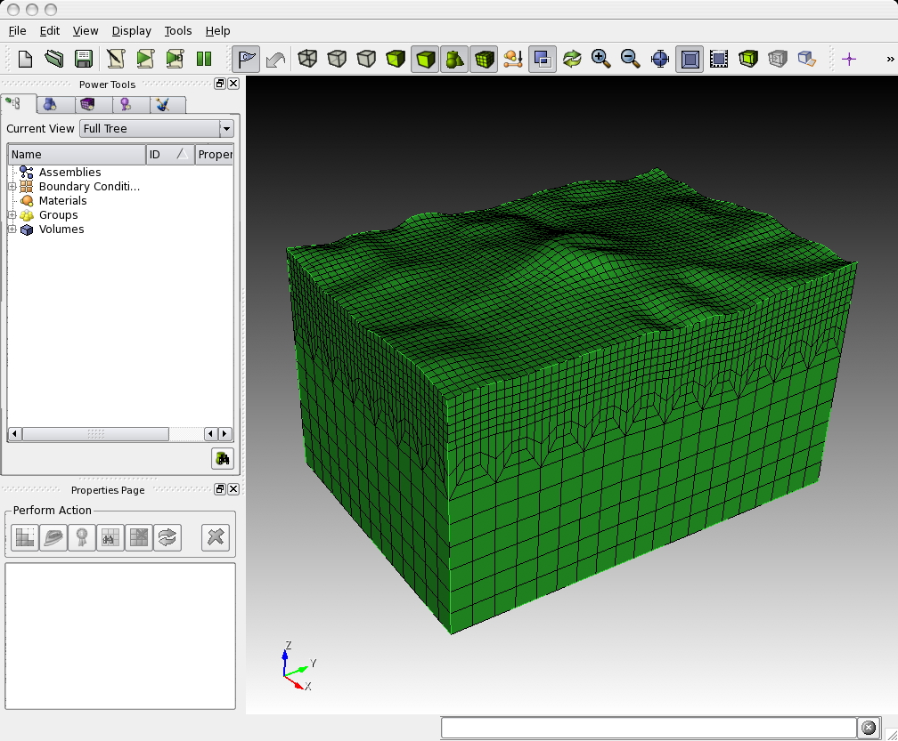

**Table of Contents**

-   [Mesh Generation](#mesh-generation)
    -   [Meshing with `CUBIT`](#meshing-with-cubit)
        -   [Creating the Mesh with CUBIT](#creating-the-mesh-with-cubit)
        -   [Exporting the Mesh with `run_cubit2specfem3d.py`](#exporting-the-mesh-with-run_cubit2specfem3dpy)
        -   [Partitioning the Mesh with `xdecompose_mesh`](#partitioning-the-mesh-with-xdecompose_mesh)
    -   [Meshing with `xmeshfem3D`](#meshing-with-xmeshfem3d)

Mesh Generation
===============

The first step in running a spectral-element simulation consists of constructing a high-quality mesh for the region under consideration. We provide two possibilities to do so: (1) relying on the external, hexahedral mesher CUBIT, or (2) using the provided, internal mesher `xmeshfem3D`. In the following, we explain these two approaches.

Meshing with `CUBIT`
--------------------

CUBIT is a meshing tool suite for the creation of finite-element meshes for arbitrarily shaped models. It has been developed and maintained at Sandia National Laboratories and can be purchased for a small academic institutional fee at <http://cubit.sandia.gov>. Our experience showed that using CUBIT greatly facilitates and speeds up the generation and preparation of hexahedral, conforming meshes for a variety of geophysical models with increasing complexity.

Figure: Example of the graphical user interface of CUBIT. The hexahedral mesh shown in the main display consists of a hexahedral discretization of a single volume with topography.

The basic steps in creating a load-balanced, partitioned mesh with CUBIT are:

1.  
setting up a hexahedral mesh with CUBIT,

2.  
exporting the CUBIT mesh into a SPECFEM3D Cartesian file format and

3.  
partitioning the SPECFEM3D Cartesian mesh files for a chosen number of cores.

Examples are provided in the SPECFEM3D Cartesian package in the subdirectory `EXAMPLES/`. We strongly encourage you to contribute your own example to this package by contacting the CIG Computational Seismology Mailing List .

### Creating the Mesh with CUBIT

For the installation and handling of the CUBIT meshing tool suite, please refer to the CUBIT user manual and documentation. In order to give you a basic understanding of how to use CUBIT for our purposes, examples are provided in the SPECFEM3D Cartesian package in the subdirectory `EXAMPLES/`:

`homogeneous_halfspace`  
Creates a single block model and assigns elastic material parameters.

`layered_halfspace`  
Combines two different, elastic material volumes and creates a refinement layer between the two. This example can be compared for validation against the solutions provided in subdirectory
`VALIDATION_3D_SEM_SIMPLER_LAYER_SOURCE_DEPTH/`.

`waterlayered_halfspace`  
Combines an acoustic and elastic material volume as in a schematic marine survey example.

`tomographic_model`  
Creates a single block model whose material properties will have to be read in from a tomographic model file during the databases creation by `xgenerate_databases`.

 
Figure: Screenshots of the CUBIT examples provided in subdirectory `EXAMPLES/`: homogeneous halfspace (top-left), layered halfspace (top-right), water layered halfspace (bottom-left) and tomographic model (bottom-right).
 

Figure: Screenshots of the CUBIT examples provided in subdirectory `EXAMPLES/`: homogeneous halfspace (top-left), layered halfspace (top-right), water layered halfspace (bottom-left) and tomographic model (bottom-right).

 
Figure: Screenshots of the CUBIT examples provided in subdirectory `EXAMPLES/`: homogeneous halfspace (top-left), layered halfspace (top-right), water layered halfspace (bottom-left) and tomographic model (bottom-right).
 

Figure: Screenshots of the CUBIT examples provided in subdirectory `EXAMPLES/`: homogeneous halfspace (top-left), layered halfspace (top-right), water layered halfspace (bottom-left) and tomographic model (bottom-right).

In each example subdirectory you will find a `README` file, which explains in a step-by-step tutorial the workflow for the example. Please feel free to contribute your own example to this package by contacting the CIG Computational Seismology Mailing List .

In some cases, to re-create the meshes for the examples given, just type

    claro ./create_mesh.py

or similar from the command line (`claro` is the command to run CUBIT from the command line).

*IMPORTANT:* In order to correctly set up GEOCUBIT and run the examples, please read the file called `EXAMPLES/README`; in particular, please make sure you correctly set up the Python paths as indicated in that file.

Concerning the script `create_mesh.py`, you may find the option `use_explicit` which chooses how to assign the material properties for the volume (or domain):

-   one way is to explicitly assign block attributes to the block of the corresponding volume, by commands like:

        cubit.cmd('block '+str(id_block)+' attribute index 2 2800') # vp

    This is done when using `use_explicit = 1` in the script. The final command:

        cubit2specfem3d.export2SPECFEM3D('MESH/')

    will then create the corresponding `MESH/nummaterial_velocity_file` for all such defined block volumes/domains.

-   the other option with `use_explicit = 0` is to let GEOCUBIT deal with a dummy entry and then overwrite the `nummaterial_velocity_file` at the end with a corresponding command section:

        f = open(nummaterial_velocity_file,'w')

    This second way is chosen by default because GEOCUBIT can handle partitions for several processes and glues everything together automatically. Thus, it adds some more sophistication when the model gets more complicated than just this single volume example.

You will find out by experimenting what is easier for your case.

### Exporting the Mesh with `run_cubit2specfem3d.py` 

Once the geometric model volumes in CUBIT are meshed, you prepare the model for exportation with the definition of material blocks and boundary surfaces. Thus, prior to exporting the mesh, you need to define blocks specifying the materials and absorbing boundaries in CUBIT. This process could be done automatically using the script `run_cubit2specfem3d.py` if the mesh meets some conditions or manually, following the block convention:

material\_name  
Each material should have a specific block defined by a unique name. The name convention of the material is to start with either **’elastic’** or **’acoustic’**. It must be then followed by a unique identifier, e.g. **’elastic 1’**, **’elastic 2’**, etc. The additional attributes to the block define the material description.

For an elastic material:

material\_id  
An integer value which is unique for this material.

Vp  
P-wave speed of the material (given in m/s).

Vs  
S-wave speed of the material (given in m/s).

rho  
density of the material (given in kg/m\(^{3}\)).

Q  
quality factor to use in case of a simulation with attenuation turned on. It should be between 1 and 9000. In case no attenuation information is available, it can be set to zero. You can either specify a single Q value, in which case it will be assumed to be pure shear attenuation \(Q_{\mu}\), or two separate values for bulk and shear attenuation, \(Q_{\kappa}\) and \(Q_{\mu}\) respectively. Note that Qmu is always equal to Qs, but Qkappa is in general not equal to Qp. To convert one to the other see doc/note\_on\_Qkappa\_versus\_Qp.pdf and utils/attenuation/conversion\_from\_Qkappa\_Qmu\_to\_Qp\_Qs\_from\_Dahlen\_Tromp\_959\_960.f90.

Please note that your Vp- and Vs-speeds are given for a reference frequency. To change this reference frequency, you change the value of `ATTENUATION_f0_REFERENCE` in the main constants file `constants.h` found in subdirectory `src/shared/`. The code uses a constant \(Q\) quality factor, write(IMAIN,\*) "but approximated based on a series of Zener standard linear solids (SLS). The approximation is thus performed in a given frequency band determined based on that `ATTENUATION_f0_REFERENCE` reference frequency.

anisotropic\_flag  
Flag describing the anisotropic model to use in case an anisotropic simulation should be conducted. See the file `model_aniso.f90` in subdirectory `src/generate_databases/` for an implementation of the anisotropic models. In case no anisotropy is available, it can be set to zero.

Note that this material block has to be defined using all the volumes which belong to this elastic material. For volumes belonging to another, different material, you will need to define a new material block.

For an acoustic material:

material\_id  
An integer value which is unique for this material.

Vp  
P-wave speed of the material (given in m/s).

0  
S-wave speed of the material is ignored.

rho  
density of the material (given in kg/m\(^{3}\)).

face\_topo  
Block definition for the surface which defines the free surface (which can have topography). The name of this block must be ’face\_topo’, the block has to be defined using all the surfaces which constitute the complete free surface of the model.

face\_abs\_xmin  
Block definition for the faces on the absorbing boundaries, one block for each surface with x=Xmin.

face\_abs\_xmax  
Block definition for the faces on the absorbing boundaries, one block for each surface with x=Xmax.

face\_abs\_ymin  
Block definition for the faces on the absorbing boundaries, one block for each surface with y=Ymin.

face\_abs\_ymax  
Block definition for the faces on the absorbing boundaries, one block for each surface with y=Ymax.

face\_abs\_bottom  
Block definition for the faces on the absorbing boundaries, one block for each surface with z=bottom.

 
Figure: Example of the block definitions for the free surface ’face\_topo’ (left) and the absorbing boundaries, defined in a single block ’face\_abs\_xmin’ (right) in CUBIT.
 

Figure: Example of the block definitions for the free surface ’face\_topo’ (left) and the absorbing boundaries, defined in a single block ’face\_abs\_xmin’ (right) in CUBIT.

Optionally, instead of specifying for each surface at the boundaries a single block like mentioned above, you can also specify a single block for all boundary surfaces and name it as one of the absorbing blocks above, e.g. ’face\_abs\_xmin’.

After the block definitions are done, you export the mesh using the script `cubit2specfem3d.py` provided in each of the example directories (linked to the common script `CUBIT_GEOCUBIT/cubit2specfem3d.py`). If the export was successful, you should find the following files in a subdirectory `MESH/`:

absorbing\_cpml\_file  
**(only needed in case of C-PML absorbing conditions)** Contains on the first line the total number of C-PML spectral elements in the mesh, and then on the following line the list of all these C-PML elements with two numbers per line: first the spectral element number, and then a C-PML flag indicating to which C-PML layer(s) that element belongs, according to the following convention:

-   Flag = 1 : element belongs to a X CPML layer only (either in Xmin or in Xmax),

-   Flag = 2 : element belongs to a Y CPML layer only (either in Ymin or in Ymax),

-   Flag = 3 : element belongs to a Z CPML layer only (either in Zmin or in Zmax),

-   Flag = 4 : element belongs to a X CPML layer and also to a Y CPML layer,

-   Flag = 5 : element belongs to a X CPML layer and also to a Z CPML layer,

-   Flag = 6 : element belongs to a Y CPML layer and also to a Z CPML layer,

-   Flag = 7 : element belongs to a X, to a Y and to a Z CPML layer, i.e., it belongs to a CPML corner.

Note that it does not matter whether an element belongs to a Xmin or to a Xmax CPML, the flag is the same in both cases; the same is true for Ymin and Ymax, and also Zmin and Zmax.

When you have an existing CUBIT (or similar) mesh stored in SPECFEM3D format, i.e., if you have existing `nodes_coords_file` and `mesh_file` files but do not know how to assign CPML flags to them, we have created a small serial Fortran program that will do that automatically for you, i.e., which will create the `absorbing_cpml_file` for you. That program is:
`utils/CPML/convert_external_layers_of_a_given_mesh_to_CPML_layers.f90`,
and a small Makefile is provided in that directory (utils/CPML).

IMPORTANT: it is your responsibility to make sure that in the input CUBIT (or similar) mesh that this code will read in SPECFEM3D format from files `nodes_coords_file` and `mesh_file` you have created layers of elements that constitute a layer of constant thickness aligned with the coordinate grid axes (X, Y and/or Z), so that this code can assign CPML flags to them. This code does NOT check that (because it cannot, in any easy way). The mesh inside these CPML layers does not need to be structured nor regular, any non-structured mesh is fine as long as it has flat PML inner and outer faces, parallel to the axes, and thus of a constant thickness. The thickness can be different for the X, Y and Z sides. But for X it must not vary, for Y it must not vary, and for Z it must not vary. If you do not know the exact thickness, you can use a slightly LARGER value in this code (say 2% to 5% more) and this code will fix that and will adjust it; never use a SMALLER value otherwise this code will miss some CPML elements.

Note: in a future release we will remove the constraint of having CPML layers aligned with the coordinate axes; we will allow for meshes that are titled by any constant angle in the horizontal plane. However this is not implemented yet.

Note: in the case of fluid-solid layers in contact, the fluid-solid interface currently needs to be flat and horizontal inside the CPML layer (i.e., bathymetry should become flat and horizontal when entering the CPML); this (small) constraint will probably remain in the code for a while because it makes fluid-solid matching inside the CPML much easier.

materials\_file  
Contains the material associations for each element. The format is:

    element_ID material_ID

where `element_ID` is the element identifier and `material_ID` is a unique identifier, positive (for materials taken from this list of materials, i.e. for which each spectral element has constant material properties taken from this list) or negative (for tomographic models, i.e. for spectral element whose real velocities and density will be assigned later by calling an external function to define model variations, for instance in the case of tomographic models; in such a case, material properties can vary inside each spectral element, i.e. be different at each of its Gauss-Lobatto-Legendre grid points).

nummaterial\_velocity\_file  
Defines the material properties.

-   For classical materials (i.e., spectral elements for which the velocity and density model will not be assigned by calling an external function to define for instance a tomographic model), the format is:

        domain_ID material_ID rho vp vs Qkappa Qmu anisotropy_flag

    where `domain_ID` **is 1 for acoustic and 2 for elastic or viscoelastic materials,** `material_ID` a unique identifier, `rho` the density in \(kg\, m^{-3}\), `vp` the P-wave speed in \(m\, s^{-1}\), `vs` the S-wave speed in \(m\, s^{-1}\), `Q` the quality factor and `anisotropy_flag` an identifier for anisotropic models. Note that both `Qkappa` and `Qmu` are ignored by the code unless `ATTENUATION` is set. If you want a model with no `Qmu` attenuation, both set `ATTENUATION` to `.false.` in the `Par_file` and set `Qmu` to 9999 here. If you want a model with no `Qkappa` attenuation, set `Qkappa` to 9999 here. Note that Qmu is always equal to Qs, but Qkappa is in general not equal to Qp. To convert one to the other see doc/note\_on\_Qkappa\_versus\_Qp.pdf and utils/attenuation/conversion\_from\_Qkappa\_Qmu\_to\_Qp\_Qs\_from\_Dahlen\_Tromp\_959\_960.f90.

-   For tomographic velocity models, please read Chapter [cha:-Changing-the] and Section [sec:Using-tomographic] ‘Using external tomographic Earth models’ for further details.

nodes\_coords\_file  
Contains the point locations in Cartesian coordinates of the mesh element corners.

mesh\_file  
Contains the mesh element connectivity. The hexahedral elements can have 8 or 27 nodes.
See picture doc/mesh\_numbering\_convention/numbering\_convention\_27\_nodes.jpg to see
in which (standard) order the points must be cited. In the case of 8 nodes, just include the first 8 points.

free\_or\_absorbing\_surface\_file\_zmax  
Contains the free surface connectivity or
the surface connectivity of the absorbing boundary surface at the top (Zmax),
depending on whether the top surface is defined as free or absorbing (`STACEY_INSTEAD_OF_FREE_SURFACE` in `DATA/Par_file`).
You should put both the surface of acoustic regions and of elastic regions in that file; that is, list all the element faces that constitute the surface of the model in that file.

absorbing\_surface\_file\_xmax  
Contains the surface connectivity of the absorbing boundary surface at Xmax
(also needed in the case of C-PML absorbing conditions, in order for the code to be able to impose Dirichlet conditions on their outer edge).

absorbing\_surface\_file\_xmin  
Contains the surface connectivity of the absorbing boundary surface at Xmin
(also needed in the case of C-PML absorbing conditions, in order for the code to be able to impose Dirichlet conditions on their outer edge).

absorbing\_surface\_file\_ymax  
Contains the surface connectivity of the absorbing boundary surface at Ymax
(also needed in the case of C-PML absorbing conditions, in order for the code to be able to impose Dirichlet conditions on their outer edge).

absorbing\_surface\_file\_ymin  
Contains the surface connectivity of the absorbing boundary surface at Ymin
(also needed in the case of C-PML absorbing conditions, in order for the code to be able to impose Dirichlet conditions on their outer edge).

absorbing\_surface\_file\_bottom  
Contains the surface connectivity of the absorbing boundary surface at the bottom (Zmin)
(also needed in the case of C-PML absorbing conditions, in order for the code to be able to impose Dirichlet conditions on their outer edge).

These mesh files are needed as input files for the partitioner `xdecompose_mesh` to load-balance the mesh. Please see the next section for further details.

In directory “CUBIT\_GEOCUBIT/” we provide a script that can help doing the above tasks of exporting a CUBIT mesh to SPECFEM3D format automatically for you: “run\_cubit2specfem3d.py”. Just edit them to indicate the path to your local installation of CUBIT and also the name of the \*.cub existing CUBIT mesh file that you want to export to SPECFEM3D format. These scripts will do the conversion for you automatically except assigning material properties to the different mesh layers. To do so, you will then need to edit the file called “nummaterial\_velocity\_file” that will have just been created and change it from the prototype created:

    0 1 vol1 --> syntax: #material_domain_id #material_id #rho #vp #vs #Q_kappa #Q_mu #anisotropy
    0 2 vol2 --> syntax: #material_domain_id #material_id #rho #vp #vs #Q_kappa #Q_mu #anisotropy

(where “vol1” and “vol2” here represent the volume labels that you have set while creating the mesh in CUBIT) to for instance

    2 1 1500 2300 1800 9999.0 9999.0 0
    2 2 1600 2500 20000 9999.0 9999.0 0

#### Checking the mesh quality

The quality of the mesh may be inspected more precisely based upon the serial code in the file `check_mesh_quality_`
`CUBIT_Abaqus.f90` located in the directory `src/check_mesh_quality_CUBIT_Abaqus/`. Running this code is optional because no information needed by the solver is generated.

Prior to running and compiling this code, you have to export your mesh in CUBIT to an ABAQUS (.inp) format. For example, export mesh block IDs belonging to volumes in order to check the quality of the hexahedral elements. You also have to determine a number of parameters of your mesh, such as the number of nodes and number of elements and modify the header of the `check_mesh_quality_CUBIT_Abaqus.f90` source file in directory `src/check_mesh_quality_CUBIT_Abaqus/`.

Then, in the main directory, type

    make xcheck_mesh_quality

and use

    ./bin/xcheck_mesh_quality

to generate an OpenDX output file (`DX_mesh_quality.dx`) that can be used to investigate mesh quality, e.g. skewness of elements, and a Gnuplot histogram (`mesh_quality_histogram.txt`) that can be plotted with gnuplot (type \``gnuplot plot_mesh_quality_histogram.gnu`’). The histogram is also printed to the screen. Analyze that skewness histogram of mesh elements to make sure no element has a skewness above approximately 0.75, otherwise the mesh is of poor quality (and if even a single element has a skewness value above 0.80, then you must definitely improve the mesh). If you want to start designing your own meshes, this tool is useful for viewing your creations. You are striving for meshes with elements with ‘cube-like’ dimensions, e.g., the mesh should contain no very elongated or skewed elements.

### Partitioning the Mesh with `xdecompose_mesh`

The SPECFEM3D Cartesian software package performs large scale simulations in a parallel ’Single Process Multiple Data’ way. The spectral-element mesh created with CUBIT needs to be distributed on the processors. This partitioning is executed once and for all prior to the execution of the solver so it is referred to as a static mapping.

An efficient partitioning is important because it leverages the overall running time of the application. It amounts to balance the number of elements in each slice while minimizing the communication costs resulting from the placement of adjacent elements on different processors. `decompose_mesh` depends on the SCOTCH library (Pellegrini and Roman 1996), which provides efficient static mapping, graph and mesh partitioning routines. SCOTCH is a free software package developed by François Pellegrini et al. from LaBRI and INRIA in Bordeaux, France, downloadable from the web page <https://gforge.inria.fr/projects/scotch/>.

In most cases, the configuration with `./configure FC=ifort` should be sufficient. During the configuration process, the script tries to find existing SCOTCH installations. In case your system has no pre-existing SCOTCH installation, we provide the source code of SCOTCH, which is released open source under the French CeCILL-C version 1 license, in directory `src/decompose_mesh/scotch_5.1.12b`. This version gets bundled with the compilation of the SPECFEM3D Cartesian package if no libraries could have been found. If this automatic compilation of the SCOTCH libraries fails, please refer to file INSTALL.txt in that directory to see further details how to compile it on your system. In case you want to use a pre-existing installation, make sure you have correctly specified the path of the SCOTCH library when using the option `--with-scotch-dir` with the `./configure` script. In the future you should be able to find more recent versions at <http://www.labri.fr/perso/pelegrin/scotch/scotch_en.html>.

![Example of a mesh partitioning onto four cores. Each single core partition is colored differently. The executable `xdecompose_mesh` can equally distribute the mesh on any arbitrary number of cores. Domain decomposition is explained in detail in Martin et al. (2008), and excellent scaling up to 150,000 processor cores in shown for instance in Carrington et al. (2008; Komatitsch, Labarta, and Michéa 2008; Martin et al. 2008; Komatitsch et al. 2010; Komatitsch 2011).](figures/mount-partitions.jpg "fig:") 
Figure: Example of a mesh partitioning onto four cores. Each single core partition is colored differently. The executable `xdecompose_mesh` can equally distribute the mesh on any arbitrary number of cores. Domain decomposition is explained in detail in Martin et al. (2008), and excellent scaling up to 150,000 processor cores in shown for instance in Carrington et al. (2008; Komatitsch, Labarta, and Michéa 2008; Martin et al. 2008; Komatitsch et al. 2010; Komatitsch 2011).
 ![Example of a mesh partitioning onto four cores. Each single core partition is colored differently. The executable `xdecompose_mesh` can equally distribute the mesh on any arbitrary number of cores. Domain decomposition is explained in detail in Martin et al. (2008), and excellent scaling up to 150,000 processor cores in shown for instance in Carrington et al. (2008; Komatitsch, Labarta, and Michéa 2008; Martin et al. 2008; Komatitsch et al. 2010; Komatitsch 2011).](figures/mount-partitions2.jpg "fig:")

Figure: Example of a mesh partitioning onto four cores. Each single core partition is colored differently. The executable `xdecompose_mesh` can equally distribute the mesh on any arbitrary number of cores. Domain decomposition is explained in detail in Martin et al. (2008), and excellent scaling up to 150,000 processor cores in shown for instance in Carrington et al. (2008; Komatitsch, Labarta, and Michéa 2008; Martin et al. 2008; Komatitsch et al. 2010; Komatitsch 2011).

When you are ready to compile, in the main directory type

    make xdecompose_mesh

If all paths and flags have been set correctly, the executable `bin/xdecompose_mesh` should be produced.

The partitioning is done in serial for now (in the next release we will provide a parallel version of that code). It needs to be run in the main directory because it expects the `./DATA/Par_file`. The synopsis is:

    ./bin/xdecompose_mesh nparts input_directory output_directory

where

-   `nparts` is the number of partitions, i.e., the number of cores for the parallel simulations,

-   `input_directory` is the directory which holds all the files generated by the Python script `cubit2specfem3d.py` explained in the previous Section [subsec:Exporting-the-Mesh], e.g. `./MESH/`, and

-   `output_directory` is the directory for the output of this partitioner which stores ACII-format files named like `proc******_Database` for each partition. These files will be needed for creating the distributed databases, and have to reside in the directory `LOCAL_PATH` specified in the main `Par_file`, e.g. in directory `./OUTPUT_FILES/DATABASES_MPI`. Please see Chapter [cha:Creating-Distributed-Databases] for further details.

Note that all the files generated by the Python script `cubit2specfem3d.py` must be placed in the `input_directory` folder before running the program.

Meshing with `xmeshfem3D`
-------------------------

In case you successfully ran the configuration script, you are also ready to compile the internal mesher. This is an alternative to CUBIT for the mesh generation of relatively simple models.

Figure: For parallel computing purposes, the model block is subdivided in \(\nprocxi\times\nproceta\) slices of elements. In this example we use \(5^{2}=25\) processors. 

In the main directory, type

    make xmeshfem3D

If all paths and flags have been set correctly, the mesher should now compile and produce the executable `bin/xmeshfem3D`. Please note that `xmeshfem3D` must be called directly from the main directory, as most of the binaries of the package.

Input for the mesh generation program is provided through the parameter file `Mesh_Par_file`, which resides in the subdirectory `DATA/meshfem3D_files/`. (to see how to use it, see the EXAMPLES specific to the internal mesher in directory `EXAMPLES/meshfem3D_examples/`. Before running the mesher, a number of parameters need to be set in the `Mesh_Par_file`. This requires a basic understanding of how the SEM is implemented, and we encourage you to read D. Komatitsch and Vilotte (1998; D. Komatitsch and Tromp 1999) and Komatitsch et al. (2004).

The mesher and the solver use UTM coordinates internally, therefore you need to define the zone number for the UTM projection (e.g., zone 11 for Los Angeles). Use decimal values for latitude and longitude (no minutes/seconds). These values are approximate; the mesher will round them off to define a square mesh in UTM coordinates. When running benchmarks on rectangular models, turn the UTM projection off by using the flag `SUPPRESS_UTM_PROJECTION`, in which case all ‘longitude’ parameters simply refer to the \(x\) axis, and all ‘latitude’ parameters simply refer to the \(y\) axis. To run the mesher for a global simulation, the following parameters need to be set in the `Mesh_Par_file`:

`LATITUDE_MIN`  
Minimum latitude in the block (negative for South).

`LATITUDE_MAX`  
Maximum latitude in the block.

`LONGITUDE_MIN`  
Minimum longitude in the block (negative for West).

`LONGITUDE_MAX`  
Maximum longitude in the block.

`DEPTH_BLOCK_KM`  
Depth of bottom of mesh in kilometers.

`UTM_PROJECTION_ZONE`  
UTM projection zone in which your model resides, only valid when `SUPPRESS_UTM_PROJECTION` is `.false.`. Use a negative zone number for the Southern hemisphere: the Northern hemisphere corresponds to zones +1 to +60, the Southern hemisphere to zones -1 to -60.

We use the WGS84 (World Geodetic System 1984) reference ellipsoid for the UTM projection. If you prefer to use the Clarke 1866 ellipsoid, edit file `src/shared/utm_geo.f90`, uncomment that ellipsoid and recompile the code.

From <http://en.wikipedia.org/wiki/Universal_Transverse_Mercator_coordinate_system>:
The Universal Transverse Mercator coordinate system was developed by the United States Army Corps of Engineers in the 1940s. The system was based on an ellipsoidal model of Earth. For areas within the contiguous United States the Clarke Ellipsoid of 1866 was used. For the remaining areas of Earth, including Hawaii, the International Ellipsoid was used. The WGS84 ellipsoid is now generally used to model the Earth in the UTM coordinate system, which means that current UTM northing at a given point can be 200+ meters different from the old one. For different geographic regions, other datum systems (e.g.: ED50, NAD83) can be used.

`SUPPRESS_UTM_PROJECTION`  
set to be `.false.` when your model range is specified in geographical coordinates, and needs to be `.true.` when your model is specified in Cartesian coordinates.

`INTERFACES_FILE `  
File which contains the description of the topography and of the interfaces between the different layers of the model, if any. The number of spectral elements in the vertical direction within each layer is also defined in this file.

`NEX_XI`  
The number of spectral elements along one side of the block. This number *must* be 8 \(\times\) a multiple of \(\nprocxi\) defined below. Based upon benchmarks against semi-analytical discrete wavenumber synthetic seismograms (Komatitsch et al. 2004), determined that a \(\nexxi=288\) run is accurate to a shortest period of roughly 2 s. Therefore, since accuracy is determined by the number of grid points per shortest wavelength, for any particular value of \(\nexxi\) the simulation will be accurate to a shortest period determined by \[\mbox{shortest period (s)}=(288/\nexxi)\times2.\label{eq:shortest_period}\] The number of grid points in each orthogonal direction of the reference element, i.e., the number of Gauss-Lobatto-Legendre points, is determined by `NGLLX` in the `constants.h` file. We generally use \(\mbox{\texttt{NGLLX\/}}=5\), for a total of \(5^{3}=125\) points per elements. We suggest not to change this value.

`NEX_ETA`  
The number of spectral elements along the other side of the block. This number *must* be 8 \(\times\) a multiple of \(\nproceta\) defined below.

`NPROC_XI`  
The number of processors or slices along one side of the block (see Figure [fig:For-parallel-computing]); we must have \(\nexxi=8\times c\times\nprocxi\), where \(c\ge1\) is a positive integer.

`NPROC_ETA`  
The number of processors or slices along the other side of the block; we must have \(\nexeta=8\times c\times\nproceta\), where \(c\ge1\) is a positive integer.

`USE_REGULAR_MESH`  
set to be `.true.` if you want a perfectly regular mesh or `.false.` if you want to add doubling horizontal layers to coarsen the mesh. In this case, you also need to provide additional information by setting up the next three parameters.

`NDOUBLINGS`  
The number of horizontal doubling layers. Must be set at least to `1` if `USE_REGULAR_MESH` is set to `.true.`. Multiple mesh doublings can be chosen, for which each an `NZ_DOUBLING_*` entry must be given. By default, we only provide two possible entries in the `Mesh_Par_file`. For higher numbers of doubling layers, additional entries must be added.

`NZ_DOUBLING_1`  
The position of the first doubling layer (only interpreted if `USE_REGULAR_MESH` is set to `.true.`).

`NZ_DOUBLING_2`  
The position of the second doubling layer (only interpreted if `USE_REGULAR_MESH` is set to `.true.` and if `NDOUBLINGS` is set to `2`). Doubling layers must be at least `2` layers apart. The layer count starts from the bottom layer. More entries must be listed by the user if `NDOUBLINGS` is larger than `2`.

`CREATE_ABAQUS_FILES`  
Set this flag to `.true.` to save Abaqus FEA mesh files for subsequent viewing. Turning the flag on generates files in the `LOCAL_PATH` directory. See Section [sec:Mesh-graphics] for a discussion of mesh viewing features.

`CREATE_DX_FILES`  
Set this flag to `.true.` to save OpenDX mesh files for subsequent viewing.

`LOCAL_PATH`  
Directory in which the partitions generated by the mesher will be written. Generally one uses a directory on the local disk of the compute nodes, although on some machines these partitions are written on a parallel (global) file system (see also the earlier discussion of the `LOCAL_PATH_IS_ALSO_GLOBAL` flag in Chapter [cha:Getting-Started]).

The mesher generates the necessary partitions in parallel, one set for each of the \(\nprocxi\times\nproceta\) slices that constitutes the mesh (see Figure [fig:For-parallel-computing]). After the mesher finishes, you can log in to one of the compute nodes and view the contents of the `LOCAL_PATH` directory to see the files generated by the mesher. These files will be needed for creating the distributed databases, and have to reside in the directory `LOCAL_PATH` specified in the main `Par_file`, e.g. in directory `OUTPUT_FILES/DATABASES_MPI`. Please see Chapter [cha:Creating-Distributed-Databases] for further details.

`NMATERIALS`  
The number of different materials in your model. In the following lines, each material needs to be defined as:

    material_ID rho vp vs Q anisotropy_flag domain_ID

where

-   `Q` : quality factor (0=no attenuation) for shear attenuation \(Q_{\mu}\)

-   `anisotropy_flag` : 0=no anisotropy / 1,2,.. check with implementation in `aniso_model.f90`

-   `domain_id` : 1=acoustic / 2=elastic

`NREGIONS`  
The number of regions in the mesh. In the following lines, because the mesh is regular or ’almost regular’, each region is defined as:

    NEX_XI_BEGIN NEX_XI_END NEX_ETA_BEGIN NEX_ETA_END NZ_BEGIN NZ_END material_ID

The `INTERFACES_FILE` parameter of `Mesh_Par_File` defines the file which contains the settings of the topography grid and of the interfaces grids. Topography is defined as a set of elevation values on a regular 2D grid. It is also possible to define interfaces between the layers of the model in the same way. The file needs to define several parameters:

-   The number of interfaces, including the topography. This needs to be set at the first line. Then, from the bottom to the top of the model, you need to define the grids with:

-   `SUPPRESS_UTM_PROJECTION` flag as described previously,

-   number of points along \(x\) and \(y\) direction (NXI and NETA),

-   minimal \(x\) and \(y\) coordinates (LONG\_MIN and LAT\_MIN),

-   spacing between points along \(x\) and \(y\) (SPACING\_XI and SPACING\_ETA) and

-   the name of the file which contains the elevation values (in \(y\).\(x\) increasing order).

At the end of this file, you simply need to set the number of spectral elements in the vertical direction for each layer. We provide a few models in the `EXAMPLES/` directory.

Finally, depending on your system, you might need to provide a file that tells MPI what compute nodes to use for the simulations. The file must have a number of entries (one entry per line) at least equal to the number of processors needed for the run. A sample file is provided in the file `mymachines`. This file is not used by the mesher or solver, but is required by the `go_mesher` and `go_solver` default job submission scripts. See Chapter [cha:Scheduler] for information about running the code on a system with a scheduler, e.g., LSF.

Now that you have set the appropriate parameters in the `Mesh_Par_file` and have compiled the mesher, you are ready to launch it! This is most easily accomplished based upon the `go_mesher` script. When you run on a PC cluster, the script assumes that the nodes are named n001, n002, etc. If this is not the case, change the `tr -d n` line in the script. You may also need to edit the last command at the end of the script that invokes the `mpirun` command. See Chapter [cha:Scheduler] for information about running the code on a system with a scheduler, e.g., LSF.

Mesher output is provided in the `OUTPUT_FILES` directory in `output_mesher.txt`; this file provides lots of details about the mesh that was generated. Please note that the mesher suggests a time step `DT` to run the solver with. The mesher output file also contains a table about the quality of the mesh to indicate possible problems with the distortions of elements. Alternatively, output can be directed to the screen instead by uncommenting a line in `constants.h`:

    ! uncomment this to write messages to the screen
    ! integer, parameter :: IMAIN = ISTANDARD_OUTPUT

To control the quality of the mesh, check the standard output (either on the screen or in the `OUTPUT_FILES` directory in `output_mesher.txt`) and analyze the skewness histogram of mesh elements to make sure no element has a skewness above approximately 0.75, otherwise the mesh is of poor quality (and if even a single element has a skewness value above 0.80, then you must definitely improve the mesh). To draw the skewness histogram on the screen, type `gnuplot plot_mesh_quality_histogram.gnu`.

References
----------

Carrington, Laura, Dimitri Komatitsch, Michael Laurenzano, Mustafa Tikir, David Michéa, Nicolas Le Goff, Allan Snavely, and Jeroen Tromp. 2008. “High-Frequency Simulations of Global Seismic Wave Propagation Using SPECFEM3D\_GLOBE on 62 Thousand Processor Cores.” In *Proceedings of the SC’08 ACM/IEEE Conference on Supercomputing*, 60:1–60:11. Austin, Texas, USA: IEEE Press. doi:[10.1145/1413370.1413432](http://dx.doi.org/10.1145/1413370.1413432).

Komatitsch, D., and J. Tromp. 1999. “Introduction to the Spectral-Element Method for 3-D Seismic Wave Propagation.” *Geophys. J. Int.* 139 (3): 806–22. doi:[10.1046/j.1365-246x.1999.00967.x](http://dx.doi.org/10.1046/j.1365-246x.1999.00967.x).

Komatitsch, D., and J. P. Vilotte. 1998. “The Spectral-Element Method: An Efficient Tool to Simulate the Seismic Response of 2D and 3D Geological Structures.” *Bull. Seism. Soc. Am.* 88 (2): 368–92.

Komatitsch, Dimitri. 2011. “Fluid-Solid Coupling on a Cluster of GPU Graphics Cards for Seismic Wave Propagation.” *C. R. Acad. Sci., Ser. IIb Mec.* 339: 125–35. doi:[10.1016/j.crme.2010.11.007](http://dx.doi.org/10.1016/j.crme.2010.11.007).

Komatitsch, Dimitri, Gordon Erlebacher, Dominik Göddeke, and David Michéa. 2010. “High-Order Finite-Element Seismic Wave Propagation Modeling with MPI on a Large GPU Cluster.” *J. Comput. Phys.* 229 (20): 7692–7714. doi:[10.1016/j.jcp.2010.06.024](http://dx.doi.org/10.1016/j.jcp.2010.06.024).

Komatitsch, Dimitri, Jesús Labarta, and David Michéa. 2008. “A Simulation of Seismic Wave Propagation at High Resolution in the Inner Core of the Earth on 2166 Processors of MareNostrum.” *Lecture Notes in Computer Science* 5336: 364–77.

Komatitsch, Dimitri, Qinya Liu, Jeroen Tromp, Peter Süss, Christiane Stidham, and John H. Shaw. 2004. “Simulations of Ground Motion in the Los Angeles Basin Based Upon the Spectral-Element Method.” *Bull. Seism. Soc. Am.* 94 (1): 187–206. doi:[10.1785/0120030077](http://dx.doi.org/10.1785/0120030077).

Martin, Roland, Dimitri Komatitsch, Céline Blitz, and Nicolas Le Goff. 2008. “Simulation of Seismic Wave Propagation in an Asteroid Based Upon an Unstructured MPI Spectral-Element Method: Blocking and Non-Blocking Communication Strategies.” *Lecture Notes in Computer Science* 5336: 350–63.

Pellegrini, F., and J. Roman. 1996. “SCOTCH: A Software Package for Static Mapping by Dual Recursive Bipartitioning of Process and Architecture Graphs.” *Lecture Notes in Computer Science* 1067: 493–98.

-----
> This documentation has been automatically generated by [pandoc](http://www.pandoc.org)
> based on the User manual (LaTeX version) in folder doc/USER_MANUAL/
> (Mar  5, 2021)

