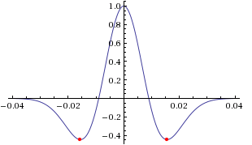

**Table of Contents**

-   [Creating the Distributed Databases](#creating-the-distributed-databases)
    -   [Main parameter file `Par_file`](#main-parameter-file-par_file)
    -   [Choosing the time step `DT`](#choosing-the-time-step-dt)

Creating the Distributed Databases
==================================

After using `xmeshfem3D` or `xdecompose_mesh`, the next step in the workflow is to compile `xgenerate_`
`databases`. This program is going to create all the missing information needed by the SEM solver.

Figure: Schematic workflow for a SPECFEM3D Cartesian simulation. The executable `xgenerate_databases` creates the GLL mesh points and assigns specific model parameters.

In the main directory, type

    make xgenerate_databases

Input for the program is provided through the main parameter file `Par_file`, which resides in the subdirectory `DATA`. Please note that `xgenerate_databases` must be called directly from the main directory, as most of the binaries of the package.

Main parameter file `Par_file`
------------------------------

Before running `xgenerate_databases`, a number of parameters need to be set in the main parameter `Par_file` located in the subdirectory `DATA`:

`SIMULATION_TYPE`  
is set to 1 for forward simulations, 2 for adjoint simulations (see Section [sec:Adjoint-simulation-finite]) and 3 for kernel simulations (see Section [sec:Finite-Frequency-Kernels]).

`SAVE_FORWARD`  
is only set to `.true.` for a forward simulation with the last frame of the simulation saved, as part of the finite-frequency kernel calculations (see Section [sec:Finite-Frequency-Kernels]). For a regular forward simulation, leave `SIMULATION_TYPE` and `SAVE_FORWARD` at their default values.

`UTM_PROJECTION_ZONE`  
UTM projection zone in which your model resides, only valid when `SUPPRESS_UTM_PROJECTION` is `.false.`.

`SUPPRESS_UTM_PROJECTION`  
set to be `.false.` when your model range is specified in the geographical coordinates, and needs to be `.true.` when your model is specified in a cartesian coordinates.

`NPROC`  
The number of MPI processors, each one is assigned one slice of the whole mesh.

`NSTEP`  
The number of time steps of the simulation. This controls the length of the numerical simulation, i.e., twice the number of time steps requires twice as much CPU time. This feature is not used at the time of generating the distributed databases but is required for the solver, i.e., you may change this parameter after running `xgenerate_databases`.

`DT`  
The length of each time step in seconds. This feature is not used at the time of generating the distributed databases but is required for the solver. Please see also Section [sec:Choosing-the-Time-Step] for further details.

`NGNOD`  
The number of nodes for 2D and 3D shape functions for hexahedra. We use either 8-node mesh elements (bricks) or 27-node elements. If you use the internal mesher, the only option is 8-node bricks (27-node elements are not supported). `CUBIT` does not support HEX27 elements either (it can generate them, but they are flat, i.e. identical to HEX8). To generate HEX27 elements with curvature properly taken into account, you can use Gmsh <http://geuz.org/gmsh/>

`MODEL`  
Must be set to one of the following:

  
`default`  
Uses model parameters as defined by meshing procedures described in the previous Chapter [cha:Mesh-Generation].

  
`1D_prem`  
Isotropic version of the spherically symmetric Preliminary Reference Earth Model (PREM) (Dziewoński and Anderson 1981).

`1D_socal`  
A standard isotropic 1D model for Southern California.

`1D_cascadia`  
Isotropic 1D profile for the Cascadia region.

  
`aniso`  
For a user-specified fully anisotropic model. Parameters are set up in routines located in file `model_aniso.f90` in directory `src/generate_databases/`. See Chapter [cha:-Changing-the] for a discussion on how to specify your own 3D model.

`external`  
For a user-specified isotropic model which uses externally defined model parameters. Uses external model definitions set up in routines located in file `model_external_values.f90` in directory `src/generate_databases/`. Please modify these generic template routines to use your own model definitions.

`gll`  
For a user-specified isotropic model which uses external binary files for \(v_{p}\), \(v_{s}\) and \(\rho\). Binary files are given in the same format as when outputted by the `xgenerate_databases` executable when using option `SAVE_MESH_FILES`. These binary files define the model parameters on all GLL points which can be used for iterative inversion procedures. Note that for simulation setups with attenuation, it will also read in the external binary mesh files for \(Q_{\kappa}\) and \(Q_{\mu}\). Note that Qmu is always equal to Qs, but Qkappa is in general not equal to Qp. To convert one to the other see `doc/note_on_Qkappa_versus_Qp.pdf` and in folder `utils/attenuation`, the tool `conversion_from_Qkappa_Qmu_to_Qp_Qs_from_Dahlen_Tromp_959_960.f90`.

`salton_trough`  
A 3D \(V_{p}\) model for Southern California. Users must provide the corresponding data file `regrid3_vel_p.bin` in directory `DATA/st_3D_block_harvard/`.

`tomo`  
For a user-specified 3D isotropic model which uses a tomographic model file `tomography_model.xyz` in directory `DATA`. See Section [sec:Using-tomographic], for a discussion on how to specify your own 3D tomographic model.

`APPROXIMATE_OCEAN_LOAD`  
Set to `.true.` if the effect of the oceans on seismic wave propagation should be incorporated based upon the (rough) approximate treatment discussed in Komatitsch and Tromp (2002a). This feature is inexpensive from a numerical perspective, both in terms of memory requirements and CPU time. This approximation is accurate at periods of roughly 20 s and longer. At shorter periods the effect of water phases/reverberations is not taken into account, even when the flag is on. If you want to model the effect of a fluid-solid model at short periods, then set this flag to `.false.` and mesh the fluid layer explicitly in your mesher, so that it is computed accurately and without this approximation.

`TOPOGRAPHY`  
This feature is only effective if `APPROXIMATE_OCEAN_LOAD` is set to `.true.`. Set to `.true.` if topography and bathymetry should be read in based upon the topography file specified in the main constants file `constants.h` found in subdirectory `src/shared/` to evaluate elevations. If not set, elevations will be read from the numerical mesh.

`ATTENUATION`  
Set to `.true.` if attenuation should be incorporated. Turning this feature on increases the memory requirements significantly (roughly by a factor of 1.5), and is numerically fairly expensive. See Komatitsch and Tromp (1999; Komatitsch and Tromp 2002b) for a discussion on the implementation of attenuation based upon standard linear solids. Please note that the Vp- and Vs-velocities of your model are given for a reference frequency. To change this reference frequency, you change the value of `ATTENUATION_f0_REFERENCE` in the main constants file `constants.h` found in subdirectory `src/shared/`. The code uses a constant \(Q\) quality factor, write(IMAIN,\*) "but approximated based on a series of Zener standard linear solids (SLS). The approximation is thus performed in a given frequency band determined based on that `ATTENUATION_f0_REFERENCE` reference frequency. Note that Qmu is always equal to Qs, but Qkappa is in general not equal to Qp. To convert one to the other see `doc/note_on_Qkappa_versus_Qp.pdf` and in folder `utils/attenuation`, the tool `conversion_from_Qkappa_Qmu_to_Qp_Qs_from_Dahlen_Tromp_959_960.f90`.

`ANISOTROPY`  
Set to `.true.` if you want to use an anisotropy model. Please see the file `model_aniso.f90` in subdirectory `src/generate_databases/` for the current implementation of anisotropic models.

`TOMOGRAPHY_PATH`  
Directory in which the tomography files are stored for using external tomographic Earth models (please read Chapter [cha:-Changing-the] and Section [sec:Using-tomographic] ‘Using external tomographic Earth models’ for further details.).

`USE_OLSEN_ATTENUATION`  
Set to `.true.` if you want to use the attenuation model that scaled from the S-wave speed model using Olsen’s empirical relation (see Olsen, Day, and Bradley (2003)).

`OLSEN_ATTENUATION_RATIO`  
Determines the Olsen’s constant in Olsen’s empirical relation (see Olsen, Day, and Bradley (2003)).

`PML_CONDITIONS`  
Set to `.true.` to turn on C-PML boundary conditions for a regional simulation. Both fluids and elastic solids are supported.

`PML_INSTEAD_OF_FREE_SURFACE`  
Set to `.true.` to turn on C-PML boundary conditions on the top surface instead of the usual free surface.

`f0_FOR_PML`  
Determines the dominant frequency that will be used in the calculation of PML damping profiles; *This should be set to the same (or similar) dominant frequency as that of the source that you will use in your simulation. It is **VERY IMPORTANT** to do that, otherwise the PML absorbing conditions can become unstable.* If you plan to use a Dirac source, then use the dominant frequency of the source wavelet with which you plan to convolve your seismograms later on in post-processing.

`STACEY_ABSORBING_CONDITIONS`  
Set to `.true.` to turn on Clayton-Enquist absorbing boundary conditions (see Komatitsch and Tromp (1999)). In almost all cases it is much better to use CPML absorbing layers (see the options above) and leave this flag to `.false.`.

`STACEY_INSTEAD_OF_FREE_SURFACE`  
Set to `.true.` to turn on absorbing boundary conditions on the top surface which by default constitutes a free surface of the model.

`BOTTOM_FREE_SURFACE`  
When STACEY\_ABSORBING\_CONDITIONS is set to .true. : absorbing conditions are defined in xmin, xmax, ymin, ymax and zmin this option BOTTOM\_FREE\_SURFACE can be set to .true. to make zmin free surface instead of absorbing condition.

`CREATE_SHAKEMAP`  
Set this flag to `.true.` to create a ShakeMap, i.e., a peak ground velocity map of the maximum absolute value of the two horizontal components of the velocity vector.

`MOVIE_SURFACE`  
Set to `.false.`, unless you want to create a movie of seismic wave propagation on the Earth’s surface. Turning this option on generates large output files. See Section [sec:Movies] for a discussion on the generation of movies. This feature is only relevant for the solver.

`MOVIE_TYPE`  
Set this flag to 1 to show the top surface (tomography + oceans) only, to 2 to show all external faces of the mesh (i.e. topography + vertical edges + bottom) in shakemaps and surface movies.

`MOVIE_VOLUME`  
Set to `.false.`, unless you want to create a movie of seismic wave propagation in the Earth’s interior. Turning this option on generates huge output files. See Section [sec:Movies] for a discussion on the generation of movies. This feature is only relevant for the solver.

`SAVE_DISPLACEMENT`  
Set this flag to `.true.` if you want to save the displacement instead of velocity for the movie frames.

`USE_HIGHRES_FOR_MOVIES`  
Set this flag to `.true.` if you want to save the values at all the NGLL grid points for the movie frames.

`NTSTEP_BETWEEN_FRAMES`  
Determines the number of timesteps between movie frames. Typically you want to save a snapshot every 100 timesteps. The smaller you make this number the more output will be generated! See Section [sec:Movies] for a discussion on the generation of movies. This feature is only relevant for the solver.

`HDUR_MOVIE`  
Determines the half duration of the source time function for the movie simulations. When this parameter is set to be 0, a default half duration that corresponds to the accuracy of the simulation is provided. Otherwise, it adds this half duration to the half duration specified in the source file `CMTSOLUTION`, thus simulates longer periods to make the movie images look smoother.

`SAVE_MESH_FILES`  
Set this flag to `.true.` to save ParaView mesh files for subsequent viewing. Turning the flag on generates large (distributed) files in the `LOCAL_PATH` directory. See Section [sec:Mesh-graphics] for a discussion of mesh viewing features.

`LOCAL_PATH`  
Directory in which the distributed databases will be written. Generally one uses a directory on the local disk of the compute nodes, although on some machines these databases are written on a parallel (global) file system (see also the earlier discussion of the `LOCAL_PATH_IS_ALSO_GLOBAL` flag in Chapter [cha:Getting-Started]). `xgenerate_databases` generates the necessary databases in parallel, one set for each of the `NPROC` slices that constitutes the mesh (see Figure [fig:mount.partitions] and Figure [fig:For-parallel-computing]). After the executable finishes, you can log in to one of the compute nodes and view the contents of the `LOCAL_PATH` directory to see the (many) files generated by `xgenerate_databases`. Please note that the `LOCAL_PATH` directory should already contain the output files of the partitioner, i.e. from `xdecompose_mesh` or `xmeshfem3D`.

`NTSTEP_BETWEEN_OUTPUT_INFO`  
This parameter specifies the interval at which basic information about a run is written to the file system (`timestamp*` files in the `OUTPUT_FILES` directory). If you have access to a fast machine, set `NTSTEP_BETWEEN_OUTPUT_INFO` to a relatively high value (e.g., at least 100, or even 1000 or more) to avoid writing output text files too often. This feature is not used at the time of meshing. One can set this parameter to a larger value than the number of time steps to avoid writing output during the run.

`NTSTEP_BETWEEN_OUTPUT_SEISMOS`  
This parameter specifies the interval at which synthetic seismograms are written in the `LOCAL_PATH` directory. If a run crashes, you may still find usable (but shorter than requested) seismograms in this directory. On a fast machine set `NTSTEP_BETWEEN_OUTPUT_SEISMOS` to a relatively high value to avoid writing to the seismograms too often. This feature is only relevant for the solver.

`USE_FORCE_POINT_SOURCE`  
Turn this flag on to use a (tilted) `FORCESOLUTION` force point source instead of a `CMTSOLUTION` moment-tensor source. When the force source does not fall exactly at a grid point, the solver interpolates the force between grid points using Lagrange interpolants. This can be useful e.g. for oil industry foothills simulations in which the source is a vertical force, normal force, tilted force, or an impact etc. Note that in the `FORCESOLUTION` file, you will need to edit the East, North and vertical components of an arbitrary (not necessarily unitary, the code will normalize it automatically) direction vector of the force vector; thus refer to Appendix [cha:Coordinates] for the orientation of the reference frame. This vector is made unitary internally in the solver and thus only its direction matters here; its norm is ignored and the norm of the force used is the factor force source times the source time function.

When using this option, by default the code can locate the force source anywhere between mesh points in order to honor its exact location; this is more precise than using the closest GLL mesh point, but it is also a bit slower. If needed, you can change that default behavior and force the code to use the closest GLL mesh point instead by setting flag `USE_BEST_LOCATION` to `.false.` instead of `.true.` in file `src/shared/constants.h.in` and running the `configure` script again and recompiling the code.

`USE_RICKER_TIME_FUNCTION`  
Turn this flag on to use a Ricker source time function, i.e., the second derivative of a Gaussian, instead of the source time functions set by default to represent a (tilted) `FORCESOLUTION` force point source or a `CMTSOLUTION` moment-tensor source. Note that we use the standard definition of a Ricker, for a dominant frequency \(f_0\): \(\mathrm{Ricker}(t) = (1 - 2 a t^2) e^{-a t^2}\), with \(a = \pi^2 f_0^2\), whose Fourier transform is thus: \(\frac{1}{2} \frac{\sqrt{\pi}\omega^2}{a^{3/2}}e^{-\frac{\omega^2}{4 a}}\) This gives the wavelet of Figure [fig:RickerWavelet].

Figure: We use the standard definition of a Ricker (i.e., second derivative of a Gaussian). Image taken from <http://subsurfwiki.org>.

Originally, if a `CMTSOLUTION` moment-tensor source is used, a (pseudo) Heaviside step function with a very short half duration is defined for elastic cases to represent the permanent slip on the fault while in the acoustic case a Gaussian source time function with a similarly short half duration is defined to physically describe actions within the fluid. Otherwise, if a `FORCESOLUTION` force source is used, a (pseudo) Dirac delta source time function is defined by default. Any other source-time function may then be obtained by convolution.

`PRINT_SOURCE_TIME_FUNCTION`  
Turn this flag on to print information about the source time function in the file `OUTPUT_FILES/plot_source_time_function.txt`. This feature is only relevant for the solver.

`NUMBER_OF_SIMULTANEOUS_RUNS`  
adds the ability to run several calculations (several earthquakes) in an embarrassingly-parallel fashion from within the same run; this can be useful when using a very large supercomputer to compute many earthquakes in a catalog, in which case it can be better from a batch job submission point of view to start fewer and much larger jobs, each of them computing several earthquakes in parallel.

To turn that option on, set parameter `NUMBER_OF_SIMULTANEOUS_RUNS` to a value greater than 1. To implement that, we create `NUMBER_OF_SIMULTANEOUS_RUNS` MPI sub-communicators, each of them being labeled `my_local_mpi_comm_world`, and we use them in all the routines in “src/shared/parallel.f90”, except in MPI\_ABORT() because in that case we need to kill the entire run.

When that option is on, of course the number of processor cores used to start the code in the batch system must be a multiple of `NUMBER_OF_SIMULTANEOUS_RUNS`, all the individual runs must use the same number of processor cores, which as usual is NPROC in the Par\_file, and thus the total number of processor cores to request from the batch system should be `NUMBER_OF_SIMULTANEOUS_RUNS` \* `NPROC`. All the runs to perform must be placed in directories called run0001, run0002, run0003 and so on (with exactly four digits).

Imagine you have 10 independent calculations to do, each of them on 100 cores; you have three options:

1/ submit 10 jobs to the batch system

2/ submit a single job on 1000 cores to the batch, and in that script create a sub-array of jobs to start 10 jobs, each running on 100 cores (see e.g. <http://www.schedmd.com/slurmdocs/job_array.html>)

3/ submit a single job on 1000 cores to the batch, start SPECFEM3D on 1000 cores, create 10 sub-communicators, cd into one of 10 subdirectories (called e.g. run0001, run0002,... run0010) depending on the sub-communicator your MPI rank belongs to, and run normally on 100 cores using that sub-communicator.

The option `NUMBER_OF_SIMULTANEOUS_RUNS` implements 3/.

`BROADCAST_SAME_MESH_AND_MODEL`  
if we perform simultaneous runs in parallel, if only the source and receivers vary between these runs but not the mesh nor the model (velocity and density) then we can also read the mesh and model files from a single run in the beginning and broadcast them to all the others; for a large number of simultaneous runs for instance when solving inverse problems iteratively this can DRASTICALLY reduce I/Os to disk in the solver (by a factor equal to `NUMBER_OF_SIMULTANEOUS_RUNS`), and reducing I/Os is crucial in the case of huge runs. Thus, always set this option to .true. if the mesh and the model are the same for all simultaneous runs. In that case there is no need to duplicate the mesh and model file database (the content of the DATABASES\_MPI directories) in each of the run0001, run0002,... directories, it is sufficient to have one in run0001 and the code will broadcast it to the others).

`USE_FAILSAFE_MECHANISM`  
if one or a few of these simultaneous runs fail, kill all the runs or let the others finish using a fail-safe mechanism (in most cases, should be set to true).

TODO / future work to do: currently the `BROADCAST_SAME_MESH_AND_MODEL` option assumes to have the (main) mesh files in `run0001/DATABASES_MPI` or `run0001/OUTPUT_FILES/DATABASES_MPI`. However, for adjoint runs you still need a `DATABASES_MPI/` folder in each of the sub-runs directories, e.g. `run0002/DATABASES_MPI`, etc. to store the forward wavefields, kernels etc. of each sub-run. This would not be needed for forward simulations.

TODO / future work to do: the sensitivity kernel summing and smoothing tools in directory src/tomography are currently not ported to this new option to do many runs simultaneously, only the solver (src/specfem3d) is. Thus these tools should work, but in their current version will need to be run for each simulation result independently.

More precisely, the current kernel summing and smoothing routines work fine, with the exception that you need to move out the mesh files (and also the parameters). This works because these routines consider multiple runs by design. You simply have to provide them the directories where the kernels are.

`GPU_MODE`  
Turn this flag on to use GPUs.

`ADIOS_ENABLED`  
Turn this flag on to enable ADIOS. If set to `.false.`, subsequent ADIOS parameters will not be considered.

`ADIOS_FOR_DATABASES`  
Turn this flag on to use ADIOS for xmeshfem3D output and xgenerate\_database input.

`ADIOS_FOR_MESH`  
Turn this flag on to use ADIOS for generated databases.

`ADIOS_FOR_FORWARD_ARRAYS`  
Turn this flag on to read and write forward arrays using ADIOS.

`ADIOS_FOR_KERNELS`  
Turn this flag on to produce ADIOS kernels that can later be visualized with the ADIOS version of combine\_vol\_data.

The present version of SPECFEM can handle fully saturated porous simulations, Christina Morency implemented Biot equation. But the code cannot calculate partially saturated cases in its state. Christina Morency is presently working on a dual porosity, dual permeability formulation, type Pride and Berryman, for an other project, but it will not be available for some time.

The way we prescribe material property for porous material in SPECFEM3D is as follow: We use a file name “nummaterial\_poroelastic\_file”, which is located in the directory `MESH/`, the format is as follow:

     rhos rhof phi c kxx kxy kxz kyy kyz kzz Ks Kf Kfr etaf mufr

where
`rho_s` = solid density,
`rho_f` = fluid density,
`phi` = porosity,
`tort` = tortuosity,
`kxx` = xx component of permeability tensor,
`kxy` = xy,yx components of permeability tensor,
`kyy` = yy component of permeability tensor,
`kxz` = xz,zx components of permeability tensor,
`kzz` = zz component of permeability tensor,
`kappa_s` = solid bulk modulus,
`kappa_f` = fluid bulk modulus,
`kappa_fr` = frame bulk modulus,
`eta_f` = fluid viscosity,
`mu_fr` = frame shear modulus.

Using an external mesh (for instance coming from CUBIT/TRELIS), poroelastic materials have the ID number 3, while 1 is acoustic and 2 is elastic (see the example in the package: EXAMPLES/homogeneous\_poroelastic).

If you use PML, the mesh elements that belong to the PML layers can be acoustic or elastic, but not viscoelastic nor poroelastic. Then, when defining your model, you should define these absorbing elements as either acoustic or elastic. In you forget to do that, the code will fix the problem by automatically converting the viscoelastic or poroelastic PML elements to elastic. This means that strictly speaking the PML layer will not be perfectly matched any more, since the physical model will change from viscoelastic or poroelastic to elastic at the entrance of the PML, but in practice this is sufficient and produces only tiny / negligible spurious reflections.

If you use PML and an external mesh (created using an external meshing tool such as CUBIT/TRELIS or similar), try to have elements inside the PML as regular as possible, i.e. ideally non-deformed cubes obtained by ‘extrusion’ of regular surface mesh elements meshing the outer edges of the computational domain without PML; by doing so, the PMLs obtained will be far more stable in time (PML being weakly unstable from a mathematical point of view, very deformed mesh elements inside the PMLs can trigger instabilities much more quickly). *We have two utilities in directory utils/CPML that do that automatically and that are very fast*. To stabilize PMLs it also helps to add a transition layer of geometrically-regular non-PML elements, in which attenuation is also turned off (i.e. \(Q_\kappa = Q_\mu = 9999\) in that layer), as in the red layer of Figure [fig:meshextrusion]. Our tools in directory utils/CPML implement that transition layer automatically.

If you use PML and an external tomographic velocity and density model, you should be careful because mathematically a PML cannot handle heterogeneities along the normal to the PML edge inside the PML layer. This comes from the fact that the damping profile that is defined assumes a constant velocity and density model along the normal direction.

Thus, you need to modify your velocity and density model in order for it to be 1D inside the PML, as shown in Figure [fig:modifyexternalvelocitymodeltousePML].

This applies to the bottom layer as well; there you should make sure that your model is 1D and thus constant along the vertical direction.

To summarize, only use a 3D velocity and density model inside the physical region, and in all the PML layers extend it by continuity from its values along the inner PML edge.

Figure: Mesh extrusion for PML (green elements) and a non-PML stabilization layer (red elements).

Figure: How to modify your external 3D velocity and density model in order to use PML. Such a modification is not needed when using Stacey absorbing boundary conditions (but such conditions are significantly less efficient).

Choosing the time step `DT`
---------------------------

The parameter `DT` sets the length of each time step in seconds. The value of this parameter is crucial for the stability of the spectral-element simulation. Your time step `DT` will depend on the minimum ratio between the distance \(h\) of neighboring mesh points and the wave speeds \(v\) defined in your model. The condition for the time step \(\Delta t\) is:

\(\Delta t<C \mathrm{min}_{\Omega}( h/v )\)

where \(C\) is the so-called Courant number and \(\Omega\) denotes the model volume. The distance \(h\) depends on the mesh element size and the number of GLL points `NGLL` specified in the main constants file `constants.h` located in the `src/shared/` subdirectory. The wave speed \(v\) is determined based on your model’s P- (or S-) wave speed values.

The database generator `xgenerate_databases`, as well as the internal mesher `xmeshfem3D`, are trying to evaluate the value of \(\Delta t\) for empirically chosen Courant numbers \(C\sim0.3\). If you used the mesher `xmeshfem3D` to generate your mesh, you should set the value suggested in `OUTPUT_FILES/output_mesher.txt` file, which is created after the mesher completed. In case you used CUBIT to create the mesh, you might use an arbitrary value when running `xgenerate_databases` and then use the value suggested in the
`OUTPUT_FILES/output_mesher.txt` file after the database generation completed. Note that the implemented Newmark time scheme uses this time step globally, thus your simulations become more expensive for very small mesh elements in high wave-speed regions. Please be aware of this restriction when constructing your mesh in Chapter [cha:Mesh-Generation].

References
----------

Dziewoński, A. M., and D. L. Anderson. 1981. “Preliminary Reference Earth Model.” *Phys. Earth Planet. Inter.* 25 (4): 297–356.

Komatitsch, D., and J. Tromp. 1999. “Introduction to the Spectral-Element Method for 3-D Seismic Wave Propagation.” *Geophys. J. Int.* 139 (3): 806–22. doi:[10.1046/j.1365-246x.1999.00967.x](http://dx.doi.org/10.1046/j.1365-246x.1999.00967.x).

———. 2002a. “Spectral-Element Simulations of Global Seismic Wave Propagation-II. 3-D Models, Oceans, Rotation, and Self-Gravitation.” *Geophys. J. Int.* 150 (1): 303–18. doi:[10.1046/j.1365-246X.2002.01716.x](http://dx.doi.org/10.1046/j.1365-246X.2002.01716.x).

———. 2002b. “Spectral-Element Simulations of Global Seismic Wave Propagation-I. Validation.” *Geophys. J. Int.* 149 (2): 390–412. doi:[10.1046/j.1365-246X.2002.01653.x](http://dx.doi.org/10.1046/j.1365-246X.2002.01653.x).

Olsen, K. B., S. M. Day, and C. R. Bradley. 2003. “Estimation of \(Q\) for Long-Period (\>2 Sec) Waves in the Los Angeles Basin.” *Bull. Seism. Soc. Am.* 93 (2): 627–38.

-----
> This documentation has been automatically generated by [pandoc](http://www.pandoc.org)
> based on the User manual (LaTeX version) in folder doc/USER_MANUAL/
> (Apr 14, 2021)

