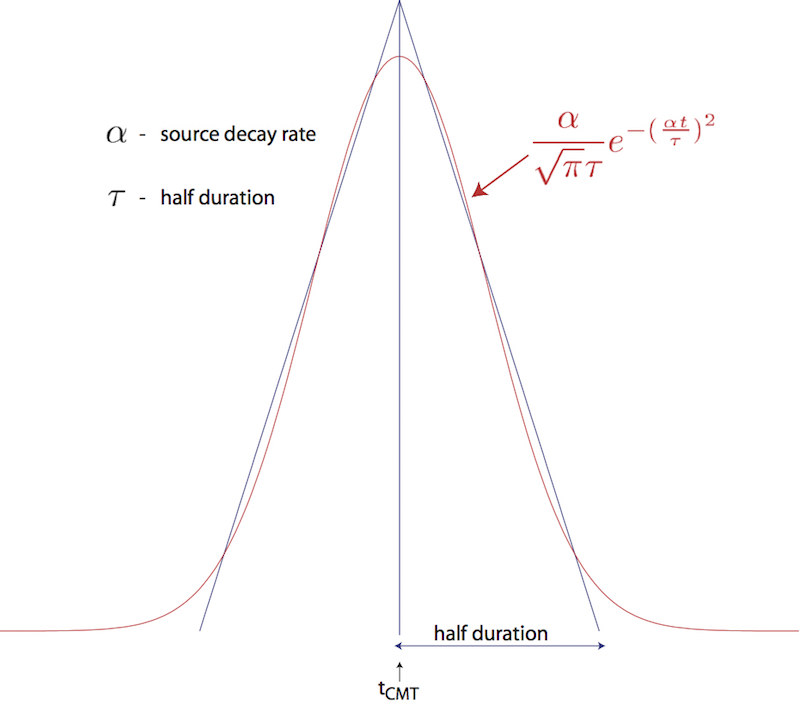
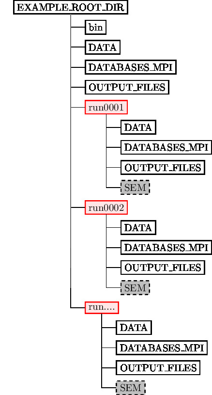
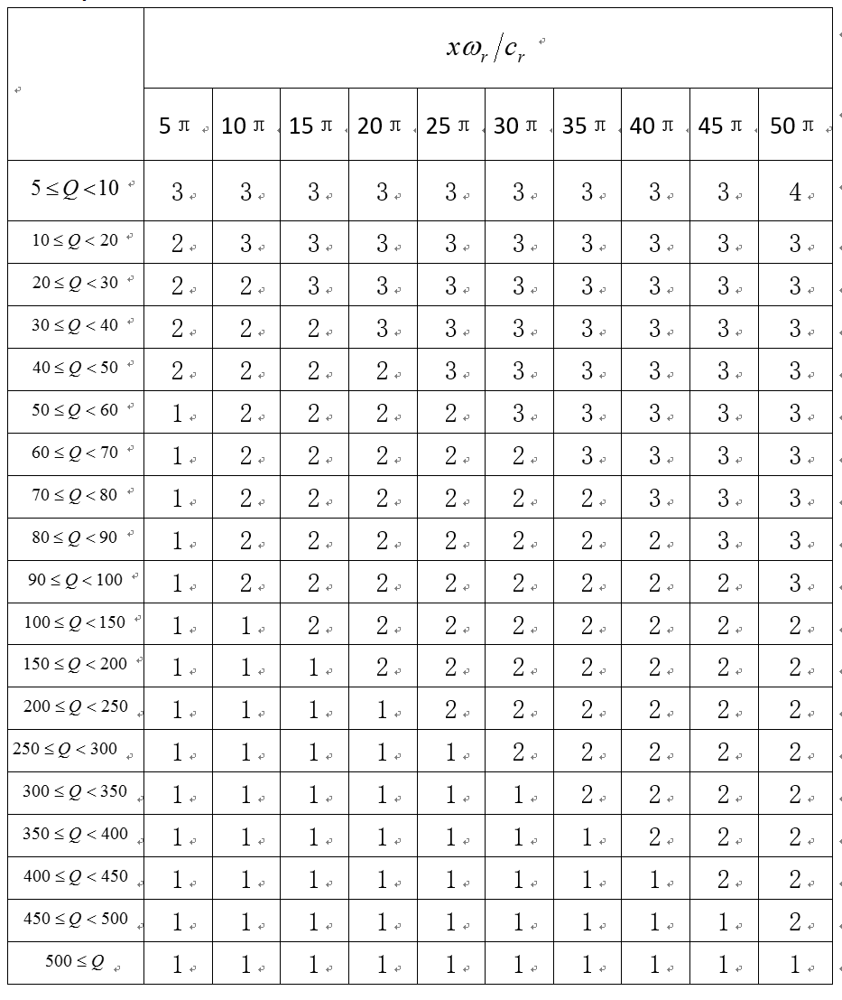

**Table of Contents**

- [Running the Solver `xspecfem3D`](#cha:Running-the-Solver)
  - [Note on the simultaneous simulation of several earthquakes](#note-on-the-simultaneous-simulation-of-several-earthquakes)
  - [Note on the viscoelastic model used](#note-on-the-viscoelastic-model-used)
  - [References](#references)

Running the Solver `xspecfem3D`
===============================

Now that you have successfully generated the databases, you are ready to compile the solver. In the main directory, type

      make xspecfem3D

Please note that `xspecfem3D` must be called directly from the main directory, as most of the binaries of the package.

The solver needs three input files in the `DATA` directory to run:

- **`Par_file`** the main parameter file which was discussed in detail in the previous Chapter [\[cha:Creating-Distributed-Databases\]](#cha:Creating-Distributed-Databases),

- **`CMTSOLUTION`** or **`FORCESOLUTION`** the earthquake source parameter file or the force source parameter file, and

- **`STATIONS`** the stations file.

Most parameters in the `DATA/Par_file` should be set prior to running the databases generation. Only the following parameters may be changed after running `xgenerate_databases`:

- the simulation type control parameters `SIMULATION_TYPE` and `SAVE_FORWARD`

- the time step parameters `NSTEP` and `DT`

- the absorbing boundary control parameter `PML_CONDITIONS` on condition that the `PML_INSTEAD_OF_FREE_SURFACE` flag remains unmodified after running the databases generation.

- the movie control parameters `MOVIE_SURFACE`, `MOVIE_VOLUME`, and `NTSTEPS_BETWEEN_FRAMES`

- the ShakeMap option `CREATE_SHAKEMAP`

- the output information parameters `MOVIE_TYPE`, `NTSTEP_BETWEEN_OUTPUT_INFO` and `NTSTEP_BETWEEN_OUTPUT_SEISMOS`

- the `PRINT_SOURCE_TIME_FUNCTION` flags

Any other change to the `DATA/Par_file` implies rerunning both the database generator `xgenerate_databases` and the solver `xspecfem3D`.

For any particular earthquake, the `CMTSOLUTION` file that represents the point source may be obtained directly from the Global Centroid-Moment Tensor (CMT) [web page](www.globalcmt.org). It looks like the example shown in Fig. [1.1](#fig:CMTSOLUTION-file).

Figure: `CMTSOLUTION` file based on the format from the Global CMT catalog. **M** is the moment tensor, $M_{0}$ is the seismic moment, and $M_{w}$ is the moment magnitude.

The `CMTSOLUTION` file should be edited in the following way:

- Set the latitude or UTM $x$ coordinate, longitude or UTM $y$ coordinate, depth of the source (in km). Remark: In principle in the international CMTSOLUTION format in geophysics the depth is given in kilometers; however for users in other fields (non-destructive testing, medical imaging, near-surface studies...) who may prefer to give the position of the source (rather than its depth from the surface), or for people who use `FORCESOLUTION` to describe the source rather than `CMTSOLUTION`, we provide an option called `USE_SOURCES_RECEIVERS_Z` in the `DATA/Par_file`, and if so that position is read from `CMTSOLUTION` in meters rather than kilometers (and again, it is then the true position in the mesh, not the depth). When option `USE_SOURCES_RECEIVERS_Z` in the `DATA/Par_file` is on, this remark applies to the position of the receivers as well.

- Set the `time shift` parameter equal to $0.0$ (the solver will not run otherwise.) The time shift parameter would simply apply an overall time shift to the synthetics, something that can be done in the post-processing (see Section [\[sec:Process-data-and-syn\]](#sec:Process-data-and-syn)).

- For point-source simulations (see finite sources, page ), setting the source half-duration parameter `half duration` equal to zero corresponds to simulating a step source-time function (Heaviside), i.e., to using a moment-rate function that is a delta function. If `half duration` is not set to zero, the code will use a smooth (pseudo) Heaviside source-time function with a corresponding Gaussian moment-rate function (i.e., a signal with a shape similar to a ‘smoothed triangle’, as explained in Komatitsch and Tromp (2002) and shown in Fig [1.2](#fig:gauss.vs.triangle)) with half-width `half duration`.

  Often, it is preferable to run the solver with `half duration` set to zero and convolve the resulting synthetic seismograms in post-processing after the run, because this way it is easy to use a variety of source-time functions (see Section [\[sec:Process-data-and-syn\]](#sec:Process-data-and-syn)). Komatitsch and Tromp (2002) determined that the noise generated in the simulation by using a step source time function may be safely filtered out afterward based upon a convolution with the desired source-time function and/or low-pass filtering. Use the serial code `convolve_source_timefunction.f90` and the script `convolve_source_timefunction.csh` for this purpose (or alternatively use signal-processing software packages such as [SAC](https://seiscode.iris.washington.edu/projects/sac)). Type

      make xconvolve_source_timefunction

  to compile the code and then set the parameter `hdur` in `convolve_source_timefunction.csh` to the desired half-duration.

- The zero time of the simulation corresponds to the center of the triangle/Gaussian, or the centroid time of the earthquake. The start time of the simulation is $t=-2.0*\texttt{half duration}$ (the 2.0 factor is to make sure the moment-rate function is very close to zero when starting the simulation. This avoids spurious high-frequency oscillations. Also, for acoustic simulations using a Gaussian STF this is set to a factor 3.0, while Ricker source-time functions use a factor 1.2). To convert to absolute time $t_{\mathrm{abs}}$, set

  $t_{\mathrm{abs}}=t_{\mathrm{pde}}+\texttt{time shift}+t_{\mathrm{synthetic}}$

  where $t_{\mathrm{pde}}$ is the time given in the first line of the `CMTSOLUTION`, `time shift` is the corresponding value from the original `CMTSOLUTION` file and $t_{\mathrm{synthetic}}$ is the time in the first column of the output seismogram.

Figure: Comparison of the shape of a triangle and the Gaussian function actually used.

If you know the earthquake source in strike/dip/rake format rather than in `CMTSOLUTION` format, use the C code `SPECFEM3D_GLOBE/utils/strike_dip_rake_to_CMTSOLUTION.c` to convert it. The conversion formulas are given for instance in Aki and Richards (1980). Note that the Aki and Richards (1980) convention is slightly different from the Global/Harvard `CMTSOLUTION` convention (the sign of some components is different). The C code outputs both.

Centroid latitude and longitude should be provided in geographical coordinates. The code converts these coordinates to geocentric coordinates (Dahlen and Tromp 1998). Of course you may provide your own source representations by designing your own `CMTSOLUTION` file. Just make sure that the resulting file adheres to the Global/Harvard CMT conventions (see Appendix [\[cha:Coordinates\]](#cha:Coordinates)). Note that the first line in the `CMTSOLUTION` file is the Preliminary Determination of Earthquakes (PDE) solution performed by the USGS NEIC, which is used as a seed for the Global/Harvard CMT inversion. The PDE solution is based upon P waves and often gives the hypocenter of the earthquake, i.e., the rupture initiation point, whereas the CMT solution gives the ‘centroid location’, which is the location with dominant moment release. The PDE solution is not used by our software package but must be present anyway in the first line of the file.

To simulate a kinematic rupture, i.e., a finite-source event, represented in terms of $N_{\mathrm{sources}}$ point sources, provide a `CMTSOLUTION` file that has $N_{\mathrm{sources}}$ entries, one for each subevent (i.e., concatenate $N_{\mathrm{sources}}$ `CMTSOLUTION` files to a single `CMTSOLUTION` file). At least one entry (not necessarily the first) must have a zero `time shift`, and all the other entries must have non-negative `time shift`. Each subevent can have its own half duration, latitude, longitude, depth, and moment tensor (effectively, the local moment-density tensor).

Note that the zero in the synthetics does NOT represent the hypocentral time or centroid time in general, but the timing of the *center* of the source triangle with zero `time shift` (Fig [1.3](#fig:source_timing)).

Although it is convenient to think of each source as a triangle, in the simulation they are actually Gaussians (as they have better frequency characteristics). The relationship between the triangle and the gaussian used is shown in Fig [1.2](#fig:gauss.vs.triangle). For finite fault simulations it is usually not advisable to use a zero half duration and convolve afterwards, since the half duration is generally fixed by the finite fault model.

The `FORCESOLUTION` file should be edited in the following way:

- The first line is only the header for the force solution, which can be used as the identifier for the force source.

- `time shift:` For a single force source, set this parameter equal to $0.0$ (The solver will not run otherwise!); the time shift parameter would simply apply an overall time shift to the synthetics, something that can be done in the post-processing (see Section [\[sec:Process-data-and-syn\]](#sec:Process-data-and-syn)).

- `hdurorf0:` Set the half duration value (s) for step source-time function, or the dominant frequency (Hz) for Ricker source-time functions. In case that the source uses a (pseudo) Dirac delta source-time function (i.e., a Gaussian with a zero half duration) to represent a force point source, a very short half duration of five time steps is automatically set by default. For a Ricker source-time function, set the dominant frequency value (f0) in Hz. See the parameter `source time function:` below for source-time functions.

- `latorUTM:` Set the latitude or UTM $x$ coordinate.

- `longorUTM:` Set the longitude or UTM $y$ coordinate.

- `depth:` Set the depth of the source (in km).

- `source time function:` Set the type of source-time function: 0 = Gaussian function, 1 = Ricker function, 2 = Heaviside (step) function, 3 = monochromatic function, 4 = Gaussian function as defined in Meschede, Myhrvold, and Tromp (2011), 5 = Brune function, and 6 = Smoothed Brune function. Please note that we have implemented time derivatives of the Brune and smoothed Brune functions as the moment rate functions. For these source time functions, `hdurorf0` is the source duration or the rise time. The Brune and smoothed Brune functions are currently implemented only for the viscoelastic simulations. When `USE_RICKER_TIME_FUNCTION` is turned on in the main parameter file `DATA/Par_file`, it will override this source time function type selection and always use a Ricker wavelet. Note that we use the standard definition of a Ricker, for a dominant frequency $f_0$: $\mathrm{Ricker}(t) = (1 - 2 a t^2) e^{-a t^2}$, with $a = \pi^2 f_0^2$, whose Fourier transform is thus: $\frac{1}{2} \frac{\sqrt{\pi}\omega^2}{a^{3/2}}e^{-\frac{\omega^2}{4 a}}$ This gives the wavelet of Figure [\[fig:RickerWavelet\]](#fig:RickerWavelet).

- `factor force source:` Set the magnitude of the force source (units in Newton N).

- `component dir vect source E:` Set the East component of a direction vector for the force source. Direction vector is not necessarily a unit vector.

- `component dir vect source N:` Set the North component of a direction vector for the force source.

- `component dir vect source Z_up:` Set the vertical component of a direction vector for the force source. Sign convention follows the positive upward direction (see Appendix A for the orientation of the reference frame).

Where necessary, set a `FORCESOLUTION` file in the same way you configure a `CMTSOLUTION` file with $N_{\mathrm{sources}}$ entries, one for each subevent (i.e., concatenate $N_{\mathrm{sources}}$ `FORCESOLUTION` files to a single `FORCESOLUTION` file). At least one entry (not necessarily the first) must have a zero `time shift`, and all the other entries must have non-negative `time shift`. Each subevent can have its own set of parameters `latitude`, `longitude`, `depth`, `half duration` etc.

Figure: Example of timing for three sources. The center of the first source triangle is defined to be time zero. Note that this is NOT in general the hypocentral time, or the start time of the source (marked as tstart). The parameter `time shift` in the `CMTSOLUTION` file would be t1(=0), t2, t3 in this case, and the parameter `half duration` would be hdur1, hdur2, hdur3 for the sources 1, 2, 3 respectively.

In addition to inbuild source-time functions, the solver can also use an external source-time function defined by the user. This option can be activated by setting `USE_EXTERNAL_SOURCE_FILE` to `.true.` in `DATA/Par_file` and by adding the name of the file containing the source-time function at the end of `FORCESOLUTION` or `CMTSOLUTION` files. The source-time function file must contain a single column with the amplitudes of the source-time function for all the time steps. The time step must be exactly the same as that used for the simulation. If the external source-time functions are same for all the sources, differing only in their respective time shift, you can define the source-time function file only for the first source and set the external source-time function file to ’reuse’ and define the appropriate value of `time shift` for all the other sources. When the flag is set to `.false.`, then the line with the external source-time function file must not appear in the files `FORCESOLUTION` and `CMTSOLUTION`, otherwise the solver will exit with an error. When using an external source file, you can still set up the source location and directivity as in the default case. In the `FORCESOLUTION` file: you set "latorUTM", "longorUTM" and "depth" to define the position of your point source. Then if you want to define a directivity, change the following lines: "component dir vect source E", "component dir vect source N" and "component dir vect source Z_UP". What you are doing is simply that you define the source position and directivity the same way as in the default case, but in addition you are specifying the path to read in a non-default source-time function from an external file.

The solver can calculate seismograms at any number of stations for basically the same numerical cost, so the user is encouraged to include as many stations as conceivably useful in the `STATIONS` file, which looks like this:

Figure: Sample `STATIONS` file. Station latitude and longitude should be provided in geographical coordinates. The width of the station label should be no more than 32 characters (see `MAX_LENGTH_STATION_NAME` in the `setup/constants.h` file), and the network label should be no more than 8 characters (see `MAX_LENGTH_NETWORK_NAME` in the `setup/constants.h` file).

Each line represents one station in the following format:

    Station Network Latitude(degrees) Longitude(degrees) Elevation(m) burial(m)

The solver `xspecfem3D` filters the list of stations in file `DATA/STATIONS` to exclude stations that are not located within the region given in the `Mesh_Par_file` (between `LATITUDE_MIN` and `LATITUDE_MAX` and between `LONGITUDE_MIN` and `LONGITUDE_MAX`). The filtered file is called `DATA/STATIONS_FILTERED`. Elevation and burial are generally applicable to geographical regions. Burial is measured down from the top surface.

For other problems in other fields (ultrasonic testing, medical imaging etc...), it may be confusing. We generally follow either one of the following procedures for those kind of problems:

- *Procedure 1:* mostly for geophysics, when the top surface is a free surface (topography) and the five other edges of the mesh are absorbing surfaces

  1.  Put the origin on the top of the model.

  2.  Let’s say you want to place two receivers at (x1,y1,z1) and (x2,y2,z2). Your STATIONS file should look like:

          BONE  GR  y1  x1  0.00  -z1
          BONE  GR  y2  x2  0.00  -z2

- *Procedure 2:* useful for other application domains, in which using the absolute $Z$ position of the sources and receivers is more standard than using their depth from the surface

  1.  In principle in the international CMTSOLUTION format in geophysics the depth is given in kilometers; however for users in other fields (non-destructive testing, medical imaging, near-surface studies...) who may prefer to give the position of the source (rather than its depth from the surface), or for people who use `FORCESOLUTION` to describe the source rather than `CMTSOLUTION`, we provide an option called `USE_SOURCES_RECEIVERS_Z` in the `DATA/Par_file`, and if so that position is read from `CMTSOLUTION` in meters rather than kilometers (and again, it is then the true position in the mesh, not the depth). When option `USE_SOURCES_RECEIVERS_Z` in the `DATA/Par_file` is on, this remark applies to the position of the receivers as well.

  2.  Let’s say you want to place two receivers at (x1,y1,z1) and (x2,y2,z2). Your STATIONS file should then look like:

          BONE  GR  y1  x1  0.00  z1
          BONE  GR  y2  x2  0.00  z2

      The option USE_SOURCES_RECEIVERS_Z set to .true. will then discard the elevation and set burial as the $z$ coordinate. Third column is Y and Fourth is X due to the latitude/longitude convention.

  You can replace the station name "BONE" with any word of length less than 32, and the network name "GR" with any word of length less than 8. And you can always plot OUTPUT_FILES/sr.vtk file in ParaView to check the source/receiver locations after your simulation.

Solver output is provided in the `OUTPUT_FILES` directory in the `output_solver.txt` file. Output can be directed to the screen instead by uncommenting a line in `setup/constants.h`:

    ! uncomment this to write messages to the screen
    ! integer, parameter :: IMAIN = ISTANDARD_OUTPUT

On PC clusters the seismogram files are generally written to the local disks (the path `LOCAL_PATH` in the `DATA/Par_file` and need to be gathered at the end of the simulation.

While the solver is running, its progress may be tracked by monitoring the ‘`timestamp``*`’ files in the `OUTPUT_FILES/` directory. These tiny files look something like this:

    Time step #          10000
    Time:     108.4890      seconds
    Elapsed time in seconds =    1153.28696703911
    Elapsed time in hh:mm:ss =     0 h 19 m 13 s
    Mean elapsed time per time step in seconds =     0.115328696703911
    Max norm displacement vector U in all slices (m) =     1.0789589E-02

The `timestamp``*` files provide the `Mean elapsed time per time step in seconds`, which may be used to assess performance on various machines (assuming you are the only user on a node), as well as the `Max norm displacement vector U in all slices (m)`. If something is wrong with the model, the mesh, or the source, you will see the code become unstable through exponentially growing values of the displacement and fluid potential with time, and ultimately the run will be terminated by the program. You can control the rate at which the timestamp files are written based upon the parameter `NTSTEP_BETWEEN_OUTPUT_INFO` in the `DATA/Par_file`.

Having set the `DATA/Par_file` parameters, and having provided the `CMTSOLUTION` (or the `FORCESOLUTION`) and `STATIONS` files, you are now ready to launch the solver! This is most easily accomplished based upon the `go_solver` script (See Chapter [\[cha:Scheduler\]](#cha:Scheduler) for information about running through a scheduler, e.g., LSF). You may need to edit the last command at the end of the script that invokes the `mpirun` command. The `runall` script compiles and runs both `xgenerate_databases` and `xspecfem3D` in sequence. This is a safe approach that ensures using the correct combination of distributed database output and solver input.

It is important to realize that the CPU and memory requirements of the solver are closely tied to choices about attenuation (`ATTENUATION`) and the nature of the model (i.e., isotropic models are cheaper than anisotropic models). We encourage you to run a variety of simulations with various flags turned on or off to develop a sense for what is involved.

For the same model, one can rerun the solver for different events by simply changing the `CMTSOLUTION` or `FORCESOLUTION` file, or for different stations by changing the `STATIONS` file. There is no need to rerun the `xgenerate_databases` executable. Of course it is best to include as many stations as possible, since this does not add to the cost of the simulation.

Note on the simultaneous simulation of several earthquakes
----------------------------------------------------------

We have also added the ability to run several calculations (several earthquakes) in an embarrassingly-parallel fashion from within the same run; this can be useful when using a very large supercomputer to compute many earthquakes in a catalog, in which case it can be better from a batch job submission point of view to start fewer and much larger jobs, each of them computing several earthquakes in parallel. To turn that option on, set parameter `NUMBER_OF_SIMULTANEOUS_RUNS` to a value greater than 1 in file `DATA/Par_file`.

When that option is on, of course the number of processor cores used to start the code in the batch system must be a multiple of `NUMBER_OF_SIMULTANEOUS_RUNS`, all the individual runs must use the same number of processor cores, which as usual is `NPROC` in the input file `DATA/Par_file`, and thus the total number of processor cores to request from the batch system should be `NUMBER_OF_SIMULTANEOUS_RUNS `$\times$` NPROC`.

Figure:  Directory structure when simulating several earthquakes at once. To improve readability, only directories have been drawn.

Figure [1.5](#fig:simultaneous_dir_struct) shows what the directory structure should looks like when simulating multiple earthquakes at ones. All the runs to perform must be placed in directories called `run0001`, `run0002`, `run0003` and so on (with exactly four digits).

- The simulation is launched within the root directory `EXAMPLE_ROOT_DIR` (usually `mpirun -np N ./bin/xspecfem3D`).

- `DATA` should contain the `Par_file` parameter file with `NUMBER_OF_SIMULTANEOUS_RUNS` as explained in Chapter [\[cha:Creating-Distributed-Databases\]](#cha:Creating-Distributed-Databases).

- `DATABASES_MPI` and OUTPUT_FILES directory may contain the mesher output but they are not required as they are superseded by the ones in the `runXXX` directories.

- `runXXXX` directories must be created beforehand. There should be be as many as `NUMBER_OF_SIMULTANEOUS_RUNS` and the numbering should be contiguous, starting from `0001`. They all should have `DATA`, `DATABASES_MPI` and `OUTPUT_FILES` directories. Additionally a `SEM` directory containing adjoint sources have to be created to perform adjoint simulations.

- `runXXXX/DATA` directories must all contain a `CMTSOLUTION` file, a `STATIONS` file along with an eventual `STATIONS_ADJOINT` file.

- If `BROADCAST_SAME_MESH_AND_MODEL` is set to `.true.` in `DATA/Par_file`, only `run0001/OUTPUT_FILES` and `run0001/DATABASES_MPI` directories need to contain the files outputted by the mesher.

- If `BROADCAST_SAME_MESH_AND_MODEL` is set to `.false.` in `DATA/Par_file`, every `runXXXX/OUTPUT_FILES` and `runXXXX/DATABASES_MPI` directories need to contain the files outputted by the mesher. Note that while the meshes might have been created from different models and parameter sets, they should have been created using the same number of MPI processes.

Note on the viscoelastic model used
-----------------------------------

The model used is a constant $Q$, thus with no dependence on frequency ($Q(f)$ = constant). See e.g. (Blanc et al. 2016).

However in practice for technical reasons it is approximated based on the sum of different Generalized Zener body mechanisms and thus the code outputs the band in which the approximation is very good, outside of that range it can be less accurate. The logarithmic center of that frequency band is the `ATTENUATION_f0` parameter defined (in Hz) in input file `DATA/Par_file`.

Regarding attenuation (viscoelasticity), in the `setup/constants.h` you need to select the number of standard linear solids (N_SLS) to use to mimic a constant $Q$ quality factor. Using N_SLS = 3 is always safe. If (and only if) you know what you are doing, you can try to reduce that in order to reduce the cost of the simulations. Figure [1.6](#fig:selectNSLS) shows values that you can consider using (again, if and only if you know what you are doing). That table has been created by Zhinan Xie using a comparison between results obtained with a truly-constant $Q$ and results obtained with its approximation based on N_SLS standard linear solids. The comparison is performed using the time-frequency misfit and goodness-of-fit criteria proposed by (Kristeková, Kristek, and Moczo 2009). The table is drawn for a dimensionless parameter representing the distance of propagation.

Figure: Table showing how you can select a value of N_SLS smaller than 3, if and only if you know what you are doing.

References
----------

Aki, K., and P. G. Richards. 1980. *Quantitative Seismology, Theory and Methods*. San Francisco, USA: W. H. Freeman.

Blanc, Émilie, Dimitri Komatitsch, Emmanuel Chaljub, Bruno Lombard, and Zhinan Xie. 2016. “Highly Accurate Stability-Preserving Optimization of the Zener Viscoelastic Model, with Application to Wave Propagation in the Presence of Strong Attenuation.” *Geophys. J. Int.* 205 (1): 427–39. <https://doi.org/10.1093/gji/ggw024>.

Dahlen, F. A., and J. Tromp. 1998. *Theoretical Global Seismology*. Princeton, New-Jersey, USA: Princeton University Press.

Komatitsch, D., and J. Tromp. 2002. “Spectral-Element Simulations of Global Seismic Wave Propagation-I. Validation.” *Geophys. J. Int.* 149 (2): 390–412. <https://doi.org/10.1046/j.1365-246X.2002.01653.x>.

Kristeková, Miriam, Jozef Kristek, and Peter Moczo. 2009. “Time-Frequency Misfit and Goodness-of-Fit Criteria for Quantitative Comparison of Time Signals.” *Geophys. J. Int.* 178 (2): 813–25. <https://doi.org/10.1111/j.1365-246X.2009.04177.x>.

Meschede, M. A., C. L. Myhrvold, and J. Tromp. 2011. “Antipodal Focusing of Seismic Waves Due to Large Meteorite Impacts on Earth.” *Geophys. J. Int.* 187: 529–37.

-----
> This documentation has been automatically generated by [pandoc](http://www.pandoc.org)
> based on the User manual (LaTeX version) in folder doc/USER_MANUAL/
> (Jan 10, 2024)

