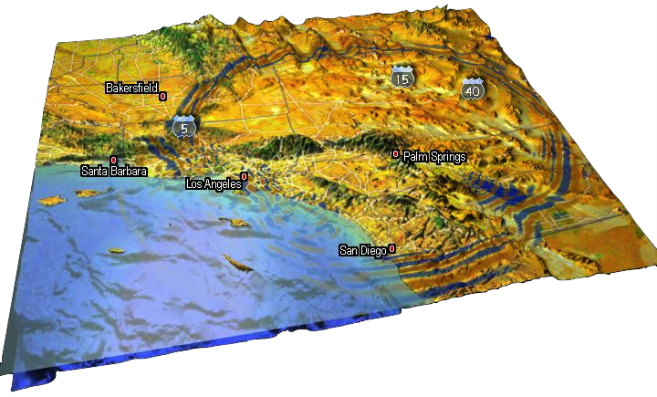

User Manual
===========
> This documentation has been automatically generated by [pandoc](http://www.pandoc.org)
> based on the User manual (LaTeX version) in folder doc/USER_MANUAL/
> (Nov 21, 2022)

>
> For the current PDF version see: [manual_SPECFEM3D_Cartesian.pdf](https://github.com/SPECFEM/specfem3d/raw/devel/doc/USER_MANUAL/manual_SPECFEM3D_Cartesian.pdf)
>

**Table of Contents**

- [01 Introduction](01_introduction)
- [02 Getting Started](02_getting_started)
- [03 Mesh Generation](03_mesh_generation)
- [04 Creating Databases](04_creating_databases)
- [05 Running The Solver](05_running_the_solver)
- [06 Fault Sources](06_fault_sources)
- [07 Adjoint Simulations](07_adjoint_simulations)
- [08 Doing Tomography](08_doing_tomography)
- [08b Performing Full Waveform Inversion FWI Or Source Inversions](08b_performing_full_waveform_inversion_FWI_or_source_inversions)
- [09 Noise Simulations](09_noise_simulations)
- [10 Gravity Calculations](10_gravity_calculations)
- [11 Graphics](11_graphics)
- [12 Running Scheduler](12_running_scheduler)
- [13 Changing The Model](13_changing_the_model)
- [14 Post Processing](14_post_processing)
- [15 Informations For Developers](15_informations_for_developers)
- [A Reference Frame](A_reference_frame)
- [B Channel Codes](B_channel_codes)
- [C Troubleshooting](C_troubleshooting)
- [D License](D_license)
- [Authors](authors)
- [Bug Reports](bug_reports)
- [Copyright And Version](copyright_and_version)
- [Features](features)
- [Notes And Acknowledgement](notes_and_acknowledgement)
- [Sponsors](sponsors)
